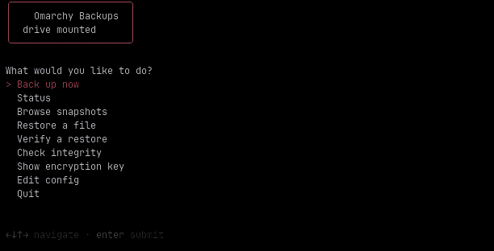

# omarchy-backups

Encrypted, versioned local backups for [Omarchy](https://omarchy.org), with a
one-key dashboard. Press **Super+B** for a menu that backs up now, browses and
restores snapshots, and checks the repository. A nightly timer runs it
unattended.

Built on [restic](https://restic.net): backups are deduplicated, compressed,
encrypted, and snapshotted, so you keep months of history in a fraction of the
space and can pull back any file from any night. The backup drive stays
readable by Windows, which suits a repurposed NTFS backup volume.

## Why

A backup should be boring: it runs on its own, it never fills the disk, and a
restore is one command when you need it. This wires restic to a local drive
with sensible defaults so you get that without assembling it yourself.

## Install

```bash
git clone https://github.com/woodcp/omarchy-backups.git ~/Work/omarchy-backups
~/Work/omarchy-backups/install.sh
```

The installer symlinks the tool into `~/.local/bin`, seeds config under
`~/.config/omarchy-backups/`, adds a **Super+B** binding, enables a nightly
timer, and reloads Hyprland. On a fresh machine it generates a random
repository encryption key and prints it once — **copy that into your password
manager immediately**, because it is the only way to restore. If an older
`cold-storage-backup` setup is present, its repository, key, and excludes are
carried over instead, so no history is lost. Choose a different hotkey with
`BACKUPS_KEY="SUPER + SHIFT + B"` before running it.

### Requirements

- `restic` (`omarchy pkg add restic`)
- `gum` for the menu, part of a stock Omarchy install
- A mounted backup drive (see below)

## First-time drive setup

The backup targets a drive mounted at a fixed path. To make an existing NTFS
volume a permanent mount, add it to `/etc/fstab` (adjust UUID and point):

```
UUID=<disk-uuid>  /mnt/cold-storage  ntfs3  rw,nofail,uid=1000,gid=1000,umask=022,windows_names  0 0
```

`nofail` means a missing drive never blocks boot, and the backup cleanly skips
a run when the drive is unmounted rather than writing to nowhere. Find the UUID
with `lsblk -no UUID <device>`.

Then set `REPO` and `MOUNT` in `~/.config/omarchy-backups/config` to match.

## The dashboard

Press **Super+B**:



| Choice | What it does |
|--------|--------------|
| Back up now | Run a backup and prune old snapshots |
| Status | Drive state, latest snapshot, disk usage |
| Browse snapshots | Page through every snapshot |
| Restore a file | Pick a snapshot and path, restore to a folder |
| Verify a restore | Restore one file and confirm it matches the original |
| Check integrity | Verify the repository's packs and blobs |
| Edit config | Open the config in your editor |

## Command line

```bash
omarchy-backups now                       # back up and prune
omarchy-backups status                    # quick health line
omarchy-backups snapshots                 # list snapshots
omarchy-backups verify                    # prove a restore works
omarchy-backups restore latest ~/Restored --include ~/Work/afoa/notes.md
omarchy-backups check                     # repository integrity
omarchy-backups key                       # print the encryption key to save it
omarchy-backups passwd [--generate]       # change or rotate the encryption key
```

Any other arguments pass straight through to `restic` against the configured
repository, so `omarchy-backups diff <a> <b>` and friends work too.

## Configuration

`~/.config/omarchy-backups/`:

| File | Purpose |
|------|---------|
| `config` | Repository path, mount point, retention counts, lock-retry window |
| `sources` | One path per line to back up (`~` expands; missing paths are skipped) |
| `excludes` | restic exclude patterns (caches, build output, container data) |
| `password` | The repository encryption key |

Default retention keeps 7 daily, 4 weekly, 6 monthly, and 2 yearly snapshots.

`RETRY_LOCK` (default `1m`) is how long a backup or integrity check waits for
the repository when another operation is already running, instead of failing
immediately. restic locks the repository per operation — a backup takes a
shared lock, an integrity check an exclusive one — so a check started while a
backup is finishing would otherwise error. With the retry window it waits for
the lock to clear. Set it to `0` to fail fast, or longer for a slow drive.

### The encryption key

Every backup is encrypted with a single key. Here is its whole life cycle.

**Created on first install.** The installer generates a random 40-character
key, prints it once, and waits for you to confirm you have saved it. The key
is written to `~/.config/omarchy-backups/password`.

**Choosing your own key instead of the generated one.** Before the first
backup, just put your own passphrase in the key file and run a backup:

```bash
printf '%s' 'your chosen passphrase' > ~/.config/omarchy-backups/password
chmod 600 ~/.config/omarchy-backups/password
omarchy-backups now
```

**Seeing it again.** While this machine is alive the key is readable, so you
can save it any time:

```bash
omarchy-backups key          # print it
omarchy-backups status       # confirms backups are encrypted and where the key lives
```

The dashboard's **Show encryption key** entry does the same.

**Changing or rotating the key.** As long as the current key still opens the
repository, you can replace it:

```bash
omarchy-backups passwd             # prompts for a new key (twice)
omarchy-backups passwd --generate  # rotate to a fresh random key
```

or the dashboard's **Change encryption key** entry. This adds the new key,
removes the old one, and updates your key file. **The old key stops working, so
save the new one right away.** This is the tool to reach for if you think your
saved copy may have been exposed.

**If you lose the key.** This is the one thing to take seriously. The key
exists in exactly two places: the file on this machine, and wherever you saved
a copy. While the machine runs, `omarchy-backups key` recovers it. But if the
machine is gone **and** you have no saved copy, the backups cannot be
decrypted by anyone, including you — that is the point of encryption, and there
is no reset or recovery. Changing the key also requires the current key, so it
cannot rescue a repository whose key is already lost.

If that ever happens, the only path forward is to start over: point `REPO` at a
new empty directory (or `restic init` a fresh one), which begins a new
encrypted history and leaves the old, unreadable one behind. **So keep a copy
of the key in your password manager. It is the one piece this tool cannot
regenerate for you.**

## What is and isn't backed up

Backed up: your work, documents, media, and real config, including `.config`,
`.ssh`, `.gnupg`, and shell files. Skipped by default: caches, downloads,
package stores, browser and chat data, and container-owned database
directories, which are unreadable at the file level and inconsistent if copied
live. Back databases up with a proper dump instead.

## System snapshot (outside $HOME)

Almost everything on Omarchy that matters lives in `$HOME`, so the sources above
cover most recovery. A few things sit outside it and can't be rebuilt from the
backup alone — most importantly your list of installed packages. A pre-backup
hook captures them into a directory the backup already includes, so every run
records a fresh system snapshot.

The installer seeds `~/.config/omarchy-backups/pre-backup.d/10-system-snapshot.sh`,
which writes to `~/.local/state/omarchy-backups/system/`:

| File | What it is |
|------|------------|
| `packages-explicit.txt` | Explicitly installed packages (`pacman -Qqe`) |
| `packages-aur.txt` | AUR / foreign packages (`pacman -Qqm`) |
| `packages-all.txt` | Everything installed, with versions |
| `fstab`, `hosts`, `os-release`, `mkinitcpio.conf`, `vconsole.conf`, `locale.conf` | Hand-edited system config |
| `services-enabled.txt` / `-user.txt` | Which services are enabled |

To reinstall every package on a rebuilt machine:

```bash
sudo pacman -S --needed - < packages-explicit.txt
```

**Root-only items** — the saved NetworkManager connections (which hold Wi-Fi
passwords) and custom `sudoers.d` rules — are copied only when the hook can read
them, so a normal nightly run skips them. To include them, run one backup with
elevated rights:

```bash
sudo -E env "PATH=$PATH" omarchy-backups now
```

Leave them out if you'd rather not store network secrets in the backup. Any
executable script you drop into `pre-backup.d/` runs before each backup, so this
is also where a "dump my dev databases first" script would go.

## Restore from scratch

On a fresh machine: install restic, mount the drive, put the password back in
place, then

```bash
restic -r /mnt/cold-storage/Omarchy/restic restore latest --target /
```

## License

MIT, Wood Consulting Partners, LLC.
